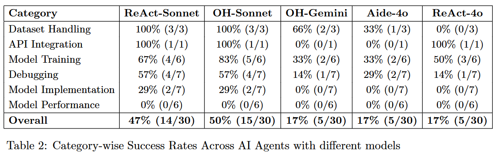
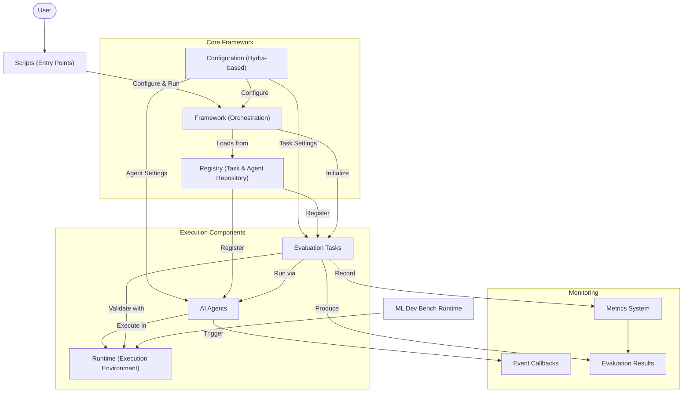

# ML-Dev-Bench

Ever wondered if AI agents can reliably develop new AI models? Look no further!

ML-Dev-Bench is a benchmark for evaluating AI agents on real world ML development tasks.

The benchmark currently includes 30 tasks covering various aspects of model development, including dataset management, debugging model and code failures, and implementing new ideas to achieve strong performance on various machine learning tasks.

We also introduce Calipers, a framework for evaluating AI agents, providing tools and infrastructure for systematic assessment of AI model performance.

[](https://arxiv.org/abs/2502.00964)

## Table of Contents
[ML-Dev-Bench](#ml-dev-bench)
  * [Highlights](#highlights)
  * [Features](#features)
  * [Adding New Evaluation Tasks](#adding-new-evaluation-tasks)
  * [Requirements](#requirements)
  * [Installation](#installation)
  * [Usage](#usage)
    + [Basic Usage](#basic-usage)
    + [Multi-run Evaluations](#multi-run-evaluations)
  * [Development](#development)
  * [Project Structure](#project-structure)
  * [Adding new Evaluation Cases](#adding-new-evaluation-cases)
  * [Adding New Agents](#adding-new-agents)
    + [Setting up Agent Dependencies using Poetry](#setting-up-agent-dependencies-using-poetry)
    + [Adding Agents Code](#adding-agents-code)
    + [Agent Docker Setup](#agent-docker-setup)
      - [Building Images](#building-images)
      - [Creating Agent Dockerfile](#creating-agent-dockerfile)
  * [Contributing](#contributing)
  * [Evaluation Traces](#evaluation-traces)
  * [License](#license)
  * [Acknowledgments](#acknowledgments)
  * [Citation](#citation)

## Highlights


**What kind of tasks are currently in ml-dev-bench?**

ml-dev-bench currently includes 30 tasks across the following categories.
| Category            | Description                                                                            |
|--------------------|----------------------------------------------------------------------------------------|
| Dataset Handling    | Downloading and preprocessing datasets                                                 |
| Model Training      | Loading pretrained models, fine-tuning                                                |
| Debugging           | Addressing errors in training files, exploding gradients, and incorrect implementations|
| Model Implementation| Modifying and implementing on top of existing model architectures                     |
| API Integration     | Integrating logging tools like WandB                                                  |
| Performance         | Improving baselines and achieving competitive results                                 |


**What kind of ML problems do these tasks cover?**

The tasks cover ML development in problem domains like image classification, segmentation, question answering, image generation, LLM finetuning and alignment, etc.

**What is the performance of different agents on these tasks?**

We currently evaluate 3 agents (ReAct, OpenHands, and AIDE) using 3 models (Claude 3.5 Sonnet, GPT-4o, and Gemini 2.0 Flash) on 30 tasks.


**What are the common failures across agents?**

Agents perform well in easier and well-defined categories like dataset handling and basic debugging with clear instructions, but struggle in open-ended and long-running tasks like model performance improvement where no agent succeeded.
Agents also fail in debugging and implementation tasks which need modifications to large existing codebases.


## Features
- Flexible evaluation framework for AI agents
- Comprehensive metrics tracking and reporting
- Integration with LiteLLM and LangChain
- Configurable task-based evaluation system using Hydra
- Support for parameter sweeps and multi-run evaluations

## Adding New Evaluation Tasks

We welcome contributions of new evaluation tasks! The process is:

1. **Propose Your Task**
   - Create a new issue using our [New Evaluation Task](https://github.com/ml-dev-bench/ml-dev-bench/issues/new?template=new_evaluation_task.yml) template
   - This helps gather feedback and ensure the task fits our evaluation framework

2. **Implement Your Task**
   - After discussion and approval, implement your task following our examples:
     - [hello_world](https://github.com/ml-dev-bench/ml-dev-bench/tree/main/ml_dev_bench/cases/hello_world) for basic task structure
     - [nan_losses](https://github.com/ml-dev-bench/ml-dev-bench/tree/main/ml_dev_bench/cases/debugging/nan_losses) for tasks with setup files and test scripts

3. **Submit Your Implementation**
   - Create a pull request using our [New Evaluation Task](https://github.com/ml-dev-bench/ml-dev-bench/compare/main...main?template=new_evaluation_task.md) template
   - Ensure all validation criteria and tests are implemented


## Requirements

- Python 3.12+
- Poetry 1.8+
- Linux, macOS, or Windows Subsystem for Linux (WSL)

## Installation

1. Clone the repository:

```bash
git clone https://github.com/ml-dev-bench/ml-dev-bench.git
cd ml-dev-bench
```

2. Install dependencies:

```bash
make build
```
This will:
- Check system requirements
- Install Python dependencies
- Set up pre-commit hooks
- Configure the development environment

3. Install runtime dependencies:

This is needed for running evaluations locally.

```bash
make install-runtime-dependencies
```

## Usage

The evaluation framework uses Hydra for configuration management, allowing flexible task and agent configurations.

### Basic Usage

Run a single task with a specific agent:
```bash
./scripts/eval.sh task=hello_world agent=openhands
```

Run with configuration overrides:
```bash
./scripts/eval.sh task=hello_world agent=openhands num_runs=3
```

### Multi-run Evaluations
Create a .env file to store the API keys for the agents you are using.

Activate the virtual environment for that agent from the root directory (e.g. for OpenHands):
```bash
source .venv-openhands/<ml-dev-bench-version>/bin/activate
```

Run all available tasks with a specific agent:
```bash
./scripts/eval.sh --multirun "task=glob(*)" agent=openhands
```
Run a list of tasks with a specific agent:
```bash
./scripts/eval.sh --multirun task=hello_world,shape_mismatch_train agent=react
```

## Development

- Format and lint code:

```bash
make lint
```
## Calipers Architecture



## Project Structure

```
.
├── calipers/
│   ├── agents/          # Agent implementations
│   ├── callbacks/       # Callback handlers
│   ├── framework/       # Core evaluation framework
│   ├── metrics/         # Metrics tracking
│   └── scripts/         # CLI tools
│
└── runtime/
    ├── backends/        # Runtime backend implementations
    ├── environments/    # Environment configurations
    └── tools/           # Runtime tools

```

## Adding new Evaluation Cases
Use the structure of the existing cases in the `ml_dev_bench/cases` directory.
You need to create a new directory in the `ml_dev_bench/cases` directory and add the new case files.
A case includes a task.txt file that lists the tasks to be run, a config.yaml file that lists the configuration for the case, and a python file that evaluates the case. Optionally, you can add a setup_workspace directory that will be cloned into the workspace for the case.

## Adding New Agents

### Setting up Agent Dependencies using Poetry
1. Add a new group in `pyproject.toml`:
```toml
[tool.poetry.group.{your-agent-name}.dependencies]
dependency1 = "^version"
dependency2 = "^version"
```

2. Add a corresponding make target in `Makefile`:
```makefile
install-{your-agent}-dependencies:
	@echo "$(GREEN)Installing Python dependencies with {your-agent} in new environment...$(RESET)"
	POETRY_VIRTUALENVS_PATH="./.venv-{your-agent}" poetry env use python$(PYTHON_VERSION)
	POETRY_VIRTUALENVS_PATH="./.venv-{your-agent}" poetry install --with {your-agent}
```

This creates a separate virtual environment with a suffix matching your agent name (e.g., `.venv-{your-agent}`).

Example: The react-agent group is set up with:
```bash
make install-react-agent-dependencies
```
This creates a dedicated environment at `.venv-react` with all react-agent specific dependencies.


### Adding Agents Code

1. Create a new directory under `agents/` with your agent name (e.g., `agents/my_agent/`)
2. Add your agent implementation files in this directory
3. Create a `Dockerfile` in your agent directory that extends the base image
4. Add agent configuration in `ml_dev_bench/conf/agent/`

Example structure:
```
agents/
├── my_agent/
│   ├── __init__.py
│   ├── my_agent.py       # Your agent implementation
│   └── Dockerfile        # Agent-specific Dockerfile
└── utils.py              # Shared utilities
```
### Agent Docker Setup
The project uses a two-stage Docker build:
1. A base image with core dependencies
2. Agent-specific images that extend the base image

#### Building Images
1. Build the base image (from project root):
```bash
docker build -t ml-dev-bench-base -f docker_base/base.Dockerfile .
```

2. Build your agent's image (from project root):
```bash
docker build -t ml-dev-bench-myagent -f agents/my_agent/Dockerfile .
```

#### Creating Agent Dockerfile
Your agent's Dockerfile should:
1. Extend the base image
2. Copy agent-specific code
3. Install agent-specific dependencies

Example agent Dockerfile:
```dockerfile
FROM ml-dev-bench-base:latest

# Copy the agent code
COPY agents/my_agent/ ./agents/my_agent/
COPY agents/__init__.py ./agents/
COPY agents/utils.py ./agents/

# Install agent-specific dependencies
RUN poetry install --with my-agent

# Set working directory
WORKDIR $WORKDIR/agents/my_agent

# Default command - open a shell with poetry env
CMD ["poetry", "shell"]
```
## Contributing

1. Fork the repository
2. Create a feature branch
3. Make your changes
4. Run linters and tests
5. Submit a pull request

## Evaluation Traces

Evaluation logs and Traces: [Link](https://drive.google.com/drive/folders/1o1FCvx_n9XVKgvkSWL97LlsfOh_KfG-S)

## License

MIT License - see the [LICENSE](LICENSE) file for details

## Acknowledgments

- LiteLLM for LLM integration
- Composio for runtime management
- Hydra for configuration management

## Citation

If you use ML-Dev-Bench in your research, please cite our paper:

```bibtex
@misc{mldevbench,
      title={ML-Dev-Bench: Comparative Analysis of AI Agents on ML development workflows},
      author={Harshith Padigela and Chintan Shah and Dinkar Juyal},
      year={2025},
      eprint={2502.00964},
      archivePrefix={arXiv},
      primaryClass={cs.SE},
      url={https://arxiv.org/abs/2502.00964},
}
```
